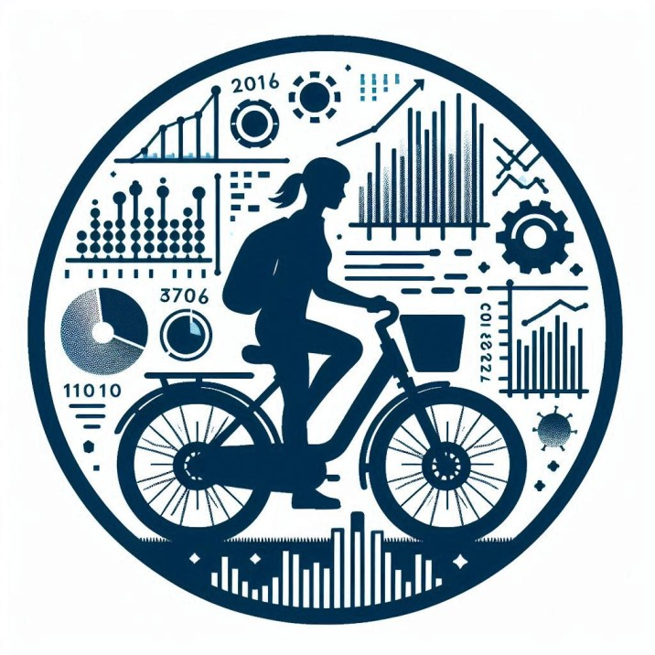
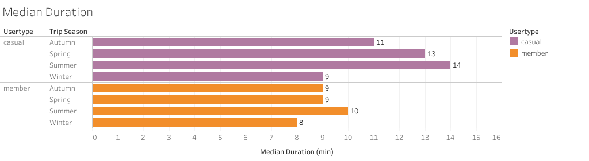

<h1 style="font-size: 1.5em; font-weight: bold; text-align: center;">Cyclistic - Analysis Presentation</h1>

  

 

# Introduction

Cyclistic is a fictional bike-sharing company Cyclistic, operating in Chicago. 
In the scenario, US. Director of Marketing believes that key to company success lies in maximizing the number of annual memberships. Data Analysis team and myself are tasked to determine how casual riders and annual members use Cyclistic bikes differently. The ultimate goal is to use these insights to create a marketing strategy that converts casual riders into annual members. 

- Company as a fleet of slightly under 10,000 bicycles that are geotracked and operate within a network of stations across Chicago. The bikes can be unlocked from one station and returned to any other station.
- Cylistic Pricing Plans: single-ride passes, full-day passes, and annual memberships. Customers who purchase <u>single-ride</u> or <u>full-day passes</u> are referred to as **casual** riders. Customers who purchase <u>annual memberships</u> are Cyclistic **members**.
- Cyclistic’s finance analysts have concluded that annual members are much more profitable than casual riders.

# Data Preparation and Validation process

Data for the project is obtained from [divvy-tripdata repository](https://divvy-tripdata.s3.amazonaws.com/index.html) and is based on real-company Lyft Bikes and Scooters and DivvyBikes data. Data was assessed and following is our conclusion in accordinace with ROCCC framework: 

- Reliable ✅
- Original ✅
- Current ✅
- Credible ✅
- Comprehensive ⚠️ 

It is a 1st party data, collected by Cyclistic themselves. It covers the priod of 01.08.2023 through 01.07.2024. Thefore, it is concluded to be reliable, original, current and credible. The only criteria where we couldn't attest data to the highest standard is Comprehensiveness. That is because data contains limitations and had some errors. While data was cleaned of errors and outliers, and processed before analyzing to enable valid insights, limitations cannot be overcome.

# Data Limitations

It is important to keep in mind limitations of the data to understand applicability limits of our findings. There are 4 main limitations. 

1. Data is anonymized for privacy reasons. It does not carry any identification info (account numbers) about the users. Therefore, we are not able to tell how many unique individual members or casual users have made the number of trips we are analyzing. It is also due to the same reason we do not know valuable information such as location of residence, age, gender, which, if present, would allow for a much more insightful analysis.
   
2. In the scenario, trips are claimed to be geo-tracked. However, we only have available coordinates of start & end stations, which does not enable us to get an adequate idea about travelled distance, directions, speed, etc. Therefore, route analysis is not possible.

3. Information about the bike type is not possible to be matched against fleet count or bike availability at the station at the time of trip booking. Therefore, we cannot reliably conclude whether difference between members and casual riders in terms of the bike choice (which, jumping ahead, is very little) is attributed to their preferences or simply a factor of availability. Additionally, it is not pointed out in the scenario, whether price for the ride is different depending ont the type of the bike used. It would be reasonable to assume so, but, strictly speaking, it is unknown. 

4. Costs of the business are unkown. It is simply given within the scenario that financial analysts concluded that members are more profitable. While it doesn't prohibit us from analyzing the data, it does limit our possibility to make insightful recommendations, because we do not know if any of our recommendations would undermine the underlying logic of member profitability. This point is separately addressed in Conclusion section. 

# Analysis and Findings

## An Overview

Before examining difference between Members and Casual riders, let us quickly have an overview of the core trip data in general. 

  

 

In terms of trip count distribution by day of the week, picture is the following. 

  

 

However, of course, since there are 5 weekdays and 2 weekends, it cannot be taken at face value. If viewed as trips per day, both weekends and weekdays are identical. 

  

 

Analyzing duration of the trips, it is seen from the table that most of the trips are short. To get a better idea of trip duration breakdown, see following chart.

 

  

 

Upper chart presents trip amount corresponding to the duration range in aboslute numbers, while lower one reflects the same data in percentages. Duration ranges were chosen like that to demonstrate clear dominance of short-duration trips. Basically, 50% of the trips are under 10 minutes, 80% under 20 minutes, and 90% under 30 minutes. 

Summer is the season where the demand for bikes is at its' highest, while Winter at its' lowest. This fits the common sense expectation that demand for bikes is highly dependent on weather conditions. 

 

  

 

  

 

To help you grasp the geographical spread of those trips, please refer to the follwing map vizualization where circles represent individual stations, and circle thickness reflects station popularity. 

 

  

 

Following chart provides an outlook as to how trips are generally distributed during 24h of the day.

 

  

 

As you may notice, during Weekdays, there are noticeable peaks around 8 A.M. in the morning and 5-6 P.M. closer to the evening. These peaks slightly smooth out on Friday and completely disappear on the Weekend. 

## Member & Casual user comparison

In light of the above data, let us now try to capture how is the picture different when the same data along similar dimensions is factored by Usertype. As you will see, there are some contrasting differences between Members and Casual users.

### Trip Count

First, we can see that Members conduct more trips than Casual riders overall.

  

 

Members account for almost 2/3 of all trips.

However, proportional distribution of Member and Casual trips per day of the week is distinctly different. Members significantly more frequently ride on Weekdays than on Weekends, while for casual users situation is the opposite. Following is the chart showing this difference. 

  

 

Following chart emphasizes this difference more clearly by looking from type of the day of the week perspective. It shows demand per weekend & weekday for both casual & member users if averaged by trips per single day. 

 

  

 

Counted like that, casual users, on average, do noticeably more trips per day on weekend, than they do on weekdays. It is the opposite for members.

A more detailed overview of trips per each day of the week for Members and Casual users is presented below. 

  

 

And if you look at the trip count per season, you could see that similar pattern applies, with the most trips carried out in Summer, followed by Autumn, then Spring and, finally, Winter. However, members demand for bikes is more stable throughout the year, while casual users spread of demand during the year is more steep.  

  

### Trip Durations

As we established in Overview, most trips are short, with 80% being under 20 minutes and 90% being under 30 minutes. However, Members and Casual users are not uniform in this pattern. Casual users, on average, ride longer trips. Following is the mean & median trip duration per usertype. 

  

 

A more detailed outlook can be seen from inspecting trip duration ranges for each user type. 

 

  

 

Same pattern overall is observable when inspecting trip duration per season. But what is additionally visually seen here is that member trip duration is much more stable and smooth throughout the year, while casual users change their behaviour according to the season, with winter ride duration dropping signficiantly in comparison with other seasons. 

 

  

 

  

 

Similar trip duration patterns of members is observed throughout the week. With members riding nearly similar duration every day, while casual users not only riding longer than members on average, but also tend to ride noticeably longer on Weekends. 

 

  

### Distribution by Station

One of the most distinct difference between member and casual riders are the geographics of their rides. Here's the overall station distribution as used by casual users and members. Size of the circles represents the busyness of the station. 

  

 

  

 

You can clearly see that the spread and diversity of stations used is noticeably higher for members rather than for casual users. 

In addition, there's a drastic difference in localization of the demand for bikes. This is better seen from the chart below showing only TOP 10 stations for each user category. 

  

 

Casual riders tend to ride along the coastline, with significant concentration at one specific station near the attraction spot. Members' demand for bikes, on the other hand, is concentrated in the downtown is more equally spread. 

### Start time of the trips

Finally, another important and insightful dimension where difference between casual riders and member exist is the time of the day when they start their trips. 

As identified in the overview, there are generally observed peak times in the morning around 8am and in the evening around 5-6pm. To some extent, it is true for both members and casual users. However, members fit this pattern much more precisely, while casual riders are not so strictly within the frame. 

  

 

Casual user demand for bikes increases gradually throughout the day and peaks around 5pm, while members demand follows a more steep increase and fall dynamic around peak times, with somewhat more stable demand during the day. 

# Conclusion

## Recap of the Findings

Following is the summary of the findings. 

- Members ride behaviour is more stable overall. It is spread more equally over the year and during the week. Slightly less stability is observed per hour of the day where member demand follows peak & fall pattern around 8AM in the morning and during Rush Hour.
- Casual riders, on the other hand, ride noticieably more on weekends than on weekdays and, the spread of the demand per season of the year is also expressed more distinctly, just 6% of the rides made in Winter. In contrast with members, however, the start hour of the trip for casual riders is less of a peak & drop pattern, but rather represents a stable increase throughout the day, peaking at the evening around 5pm and then dropping down. 

- Members tend to ride shorter rides in general. The spread of duration seasonally and during the week is very little, remaining almost completely the same. 
- On the other hand, casual riders ride longer on average and their ride duration visibly differs, with distinctly longer rides made on weekends as opposed to weekdays, and during the summer as opposed to other seasons and, especially, Winter. 

- Geographically, members have more spread throughout the city, with overall demand concentrated in the downtown. 
- On the other side, casual users spread is overall slightly less than that of the members. And their demand for bikes is concentrated along the coastline.

## Data-driven insights and recommendations

Considering the prevalence of the weekdays, trip start schedule concentration in the morning and rush hour, geographical concentration in the downtown, and stable short duration of the rides, main intuitive insight is that members largely use bike-sharing services for daily commutement to work, school, and for other daily purpose-driven activities. In contrast, casual riders have distinct prevalenece of trips made on weekends, largely during the summer, not structured around hourly work routine and rides being usually longer than those of members, suggests that casual users likely use bike-sharing for leisure. 

In order to convert casual users to members, generally, we can go one of the 2 polar directions.

1. We can attempt to accommodate the different bike usage behaviour manifested by casual users. Meaning, that we should expand existing membership proposal to make it more suitable to casual user profile. 
2. We can attempt to run membership promotions among casual users to make them consider changing their behaviour and shifting to more business-oriented bike use. 

A different option would lie somewhere in-between the above two. 

First option clearly adapts to the identified profile of casual users and, therefore, intuitively appears to be a straighforward path to make membership appealing to those type of riders. The problem with that direction is the one mentioned in data limitations section. Namely, such approach implies changing the underlying structure of membership pricing and, therefore, it is unknown whether it will remain as profitable as determined by financial analysts in its' current version. 

Second option is limited in a sense that it's using findings of our analysis only to determine when and where to run promotion to target casual users better. This would be during summertime, in the evening and along the coastline. However, it makes no use of the data to propose sensible adjustment to the pricing structure.

The above being said, I would recommend opting for a more conservative and gradual approach in line with 2nd direction. Make no or minor adjustments to membership pricing structure to preserve profitability as determined by financial analysts, use identified information to execute promotions campaigns for casual riders in a more targeted way. Additionally, for personalized e-mail or phone promotions, I would recommend taking on experimental approach and run multiple different personalized campaigns to establish what is the most effective measure increasing conversion. Finally, I would suggest collecting more data from casual users and members by running surveys to try to identify first-hand information as to what would prompt casual users to become members and what do members value in having a membership. Possibly, also asking members how they decided to become members, after how long of a time using services on casual basis and what influenced their decision. 

Ultimately, the choice how to use this data lies with marketing team. From our side, we will be happy to work together with both marketing and financial teams to help model the decisions, their expected outputs and carry out the project further to deployment and post-deployment assessment.  

